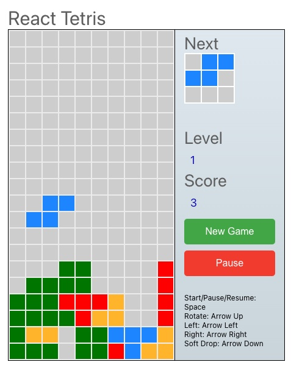

Automating Tetris Game Deployments: DevSecOps with ArgoCD, Terraform, and Jenkins for Two Game Versions 

<h1 align="left">
  
</h1>

* DevSecOps automation, where cutting-edge technologies merge to streamline the   deployment of one of the most beloved classic games, Tetris. In this project, I embarked a fascinating journey that unveils the power of ArgoCD, Terraform, and Jenkins in orchestrating a seamless and secure deployment pipeline for not one, but two distinct versions of the Tetris game. Imagine a scenario where your Tetris application effortlessly transitions through various stages of development, from infrastructure provisioning to continuous integration and delivery, all while maintaining the highest standards of security.

<h1 align="right">
  
</h1>
<h1 align="left">
  
</h1>


Prerequisites:

- AWS Account: 
To get started, you’ll need an active AWS account. Ensure that you have access and permission to create and manage AWS resources.
- AWS CLI:
 Install the AWS Command Line Interface (CLI) on your local machine and configure it with your AWS credentials. This is essential for managing your AWS resources.
- IAM User and Key Pair:
 Create an IAM (Identity and Access Management) user with the necessary permissions to provision resources on AWS. Additionally, generate an IAM Access Key and Secret Access Key for programmatic access. Ensure that you securely manage these credentials.
- S3 Bucket:
 Set up an S3 bucket to store your Terraform state files. This bucket is crucial for maintaining the state of your infrastructure and enabling collaboration.
- Terraform:
 Install Terraform on your local machine. Terraform is used for provisioning infrastructure as code and managing AWS resources. Make sure to configure Terraform to work with your AWS credentials and your S3 bucket for state storage.

 - ArgoCD:
 ArgoCD automates the deployment of Tetris game applications to Kubernetes clusters. It continuously monitors Git repositories for changes in application manifests and automatically updates deployed applications to maintain their desired state.

 GitHub REPOSITORIES

TETRIS-VERSION1

https://github.com/SAKETH20002/my_tetris_v1.git

TETRIS-VERSION2

https://github.com/SAKETH20002/my_tetris_v2.git

TETRIS_MANIFEST

https://github.com/SAKETH20002/tetris_manifest.git

1. In the jenkins I have created a parameterised pipeline script to  create/destroy the eks cluster .
```
 pipeline{
    agent any
    stages{
        stage("git pull") {
            steps {
               git branch: 'main', url: 'https://github.com/SAKETH20002/my_tetris_v1.git'
            }
        }
        stage("terrform init") {
            steps{
                dir('terraform-EKS') {
                   sh "terraform init "
                }
            }
        }
        stage("terrform  validate ") {
            steps{
                dir('terraform-EKS') {
                   sh "terraform validate "
                }
            }
        }
        stage("terrform fmt") {
            steps{
                dir('terraform-EKS') {
                   sh "terraform fmt "
                }
            }
        }
        stage("terrform plan") {
            steps{
                dir('terraform-EKS') {
                   sh "terraform plan "
                }
            }
        }
        stage("terrform apply") {
            steps{
                sh "echo 'hi' "
                 dir('terraform-EKS') {
                   sh "terraform ${pickone} --auto-approve"
                }
            }
        }
    }
}
```
<h1 align="center">
  
</h1>

3. 
THEN I created a new JOB using pipeline script to Push the image of version1 to docker hub.
```
pipeline{
    agent any 
    tools {
        jdk 'JAVA_HOME'
        nodejs 'NODER'
    }
    stages{
        stage ("clean workspace"){
            steps{
                cleanWs()
            }
        }   
        stage ("git pull"){
            steps{
                git branch: 'master', url: 'https://github.com/SAKETH20002/my_tetris_v1.git'
            }
        }
        stage ("sonar analysis"){
            environment {
                SCANNER_HOME=tool 'sonarhome'
            }
            steps {
                withSonarQubeEnv('sonarserver') {    
                   sh ''' $SCANNER_HOME/bin/sonar-scanner  -Dsonar.projectKey=tetris_v1 \
                      -Dsonar.sources=. \
                      -Dsonar.host.url=http://34.217.59.146:9000  '''
                      
                }
            }
        }
        stage("quality gate"){
            steps {
                script {
                    waitForQualityGate abourtPipeline: false, credentialId: "sonartoken"
                }
            }
        }
        stage("install dependencies"){
            steps{
                sh "npm install"
            }
        }
        stage("owasp scan"){
            steps{
                dependencyCheck additionalArguments: '--scan ./ --disableYarnAudit --disableNodeAudit', odcInstallation: 'OWASP'
                dependencyCheckPublisher pattern: '**/dependency-check-report.xml'
            }
        }
        stage("trivy scan"){
            steps{
                sh"trivy fs . > trivyscan.txt"
            }
        }
        stage("docker build and push"){
            steps{
                script{
                    withDockerRegistry(credentialsId: 'Dockerhub', toolName: 'DOCKER') {
                            sh " docker build -t sakethmutyala/tetris:v1 ."
                            sh " docker push sakethmutyala/tetris:v1"
                    }
                }
            }
        }
        stage("docker image scan"){
            steps{
                sh "trivy image sakethmutyala/tetris:v1  > trivy_image.txt "
            }
        }
        stage("trigger git"){
            steps{
                build job: 'git_push', waitForStart: true
            }
        }
        
    }
}
```
3. I created a 3rd job to change the image automatically in the manifestfile which is in the repo "https://github.com/SAKETH20002/tetris_manifest.git"
```
pipeline {
    agent any

    stages {
        stage('Hello') {
            steps {
                echo 'Hello World'
            }
        }
        stage('Checkout Code') {
            steps {
                git branch: 'master', url: 'https://github.com/SAKETH20002/tetris_manifest.git'
            }
         }    
        stage("github change ") {
            
            steps{
                script {
                withCredentials([string(credentialsId: 'github', variable: 'Github')]) {
                       NEW_IMAGE_NAME = "sakethmutyala/tetris:v1" 
                       GIT_USER_NAME = "SAKETH20002"
                       GIT_REPO_NAME = "tetris_manifest"
                       
                       sh "sed -i 's|image: .*|image: $NEW_IMAGE_NAME|' deployment.yml"
                       sh 'git add deployment.yml'
                       sh "git commit -m 'Update deployment image to $NEW_IMAGE_NAME'"
                       sh "git push https://${Github}@github.com/${GIT_USER_NAME}/${GIT_REPO_NAME} HEAD:master"
                    }
                }
            }
        }    
    }
}
```
AND THIS REPO IS INTEGRATED WITH THE AGROCD :
<h1 align="center">
  
</h1>

WHEN I HIT THE INGRESS OF THE SERVICE ON THE BROWSER I GOT :

<h1 align="center">
  
</h1>

4. Then  I  created  a new JOB using pipeline script to Push the image of version2 to docker hub.
```
pipeline{
    agent any 
    tools {
        jdk 'JAVA_HOME'
        nodejs 'NODER'
    }
    stages{
        stage ("clean workspace"){
            steps{
                cleanWs()
            }
        }   
        stage ("git pull"){
            steps{
                git branch: 'master', url: 'https://github.com/SAKETH20002/my_tetris_v2.git'
            }
        }
        stage ("sonar analysis"){
            environment {
                SCANNER_HOME=tool 'sonarhome'
            }
            steps {
                withSonarQubeEnv('sonarserver') {    
                   sh ''' $SCANNER_HOME/bin/sonar-scanner  -Dsonar.projectKey=tetris_v2 \
                      -Dsonar.sources=. \
                      -Dsonar.host.url=http://34.217.59.146:9000  '''
                      
                }
            }
        }
        stage("quality gate"){
            steps {
                script {
                    waitForQualityGate abourtPipeline: false, credentialId: "sonartoken"
                }
            }
        }
        stage("install dependencies"){
            steps{
                sh "npm install"
            }
        }
        stage("owasp scan"){
            steps{
                dependencyCheck additionalArguments: '--scan ./ --disableYarnAudit --disableNodeAudit', odcInstallation: 'OWASP'
                dependencyCheckPublisher pattern: '**/dependency-check-report.xml'
            }
        }
        stage("trivy scan"){
            steps{
                sh"trivy fs . > trivyscan.txt"
            }
        }
        stage("docker build and push"){
            steps{
                script{
                    withDockerRegistry(credentialsId: 'Dockerhub', toolName: 'DOCKER') {
                            sh " docker build -t sakethmutyala/tetris:v2 ."
                            sh " docker push sakethmutyala/tetris:v2"
                    }
                }
            }
        }
        stage("docker image scan"){
            steps{
                sh "trivy image sakethmutyala/tetris:v2  > trivy_image.txt "
            }
        }
        stage('Checkout Code') {
            steps {
                git branch: 'master', url: 'https://github.com/SAKETH20002/tetris_manifest.git'
            }
         }    
        stage("github change ") {
            
            steps{
                script {
                withCredentials([string(credentialsId: 'github', variable: 'Github')]) {
                       NEW_IMAGE_NAME = "sakethmutyala/tetris:v2" 
                       GIT_USER_NAME = "SAKETH20002"
                       GIT_REPO_NAME = "tetris_manifest"
                       
                       sh "sed -i 's|image: .*|image: $NEW_IMAGE_NAME|' deployment.yml"
                       sh 'git add deployment.yml'
                       sh "git commit -m 'Update deployment image to $NEW_IMAGE_NAME'"
                       sh "git push https://${Github}@github.com/${GIT_USER_NAME}/${GIT_REPO_NAME} HEAD:master"
                    }
                }
            }
        }
        
        
        
    }
}

```

This will have same stages as the version1 and it includes the changeing of  new image in the manifest file stage too .

5. After few minutes of applying changes in the manifest repository  the AGROCD will see the changes and make it in the cluster accordingly . SO , when I refresh the link where my first version is present , I got the version 2 of the tetris game.

<h1 align="center">
  
</h1>

* In this journey through the world of DevSecOps and automated deployments, I’ve explored the remarkable capabilities of ArgoCD, Terraform, and Jenkins. From the initial infrastructure setup to deploying not one but two versions of the beloved Tetris game, I’ve witnessed how these tools can work harmoniously to create a streamlined and secure DevOps pipeline.

* The power of automation is not just a convenience ,it’s a necessity in today’s fast-paced development landscape. With the right tools and practices, you can save time, reduce errors, and ensure the highest standards of security in your deployments. This project has been a testament to the incredible possibilities that arise when you combine the art of DevOps with the precision of modern cloud-native technologies.


